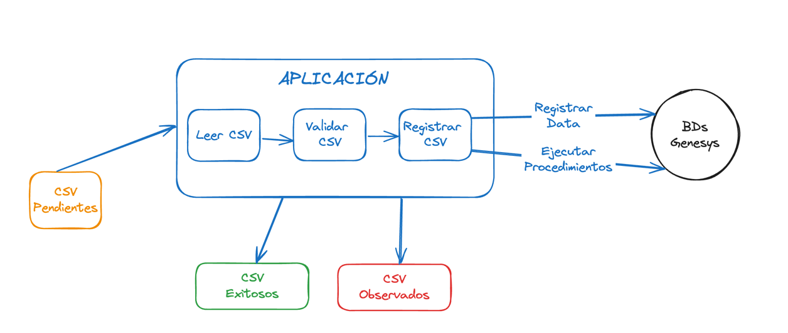

# Carga de CSVs a Genesys

Aplicación para la validación y carga de archivos CSV provenientes del sistema OneHR al sistema ERP Genesys

### Flujo general



### Requerimientos de la Aplicación

* [Python 3.12](https://www.python.org/downloads/)
* Microsoft ODBC Driver for SQL
  Server: [Drivers](https://learn.microsoft.com/en-us/sql/connect/odbc/microsoft-odbc-driver-for-sql-server?view=sql-server-ver16)
* DSN para cada base de datos a utilizar: Ejemplos [Windows](https://www.youtube.com/watch?v=61BzALfuvLQ&t=1s)
  y [Unix](https://www.youtube.com/watch?v=id0GX4sXnyI)

## Descarga del codigo fuente

- Cambia el directorio de trabajo actual a la ubicación en donde quieres clonar el directorio.
- Escribe `git clone` y pega la URL del proyecto:

    ```bash 
    git clone https://gitlab.com/betoharris/unilabs_csv_to_genesys.git
    ```

## Creación y activación de entorno virtual de Python

### Creación

* Cambiar al directorio de descarga del código fuente.
* Verificar que python está instalado con la versión correcta ejecutando `python -V`.
* Ejecutar el comando para crear el entorno virtual.

    ```bash
    python -m venv venv
    ```

### Activación

#### Windows

```bash
.\venv\Scripts\activate
```

#### Unix

```bash
source venv/bin/activate
```

## Instalación de dependencias

Activar el entorno virtual como se describe en el paso previo y ejecutar el comando:

```bash
pip install -r requirements.txt
```

## Configuración

Crear el archivo `config.toml`. Como referencia se presenta el archivo [config.toml.example](config.toml.example).

### Secciones de la Configuración

#### Variables generales

* **db_identifiers**: Lista con los identificadores de cada base de datos. `['PE001', 'PE002']`.
* **execute_procedures**: `true` o `false` - Indica si se ejecutarán los procedimientos almacenados o no.
* **logger**: Indica el nivel de detalle de escritura de logs. La configuración detallada está en el archivo
  [logging_config.yaml](logging_config.yaml).

#### Configuración de la base de datos

Por cada base de datos se debe indicar lo siguiente:

* **[db.'ID']**: El identificador de la BD.
* **dsn**: El DSN que se ha configurado en el ODBC.
* **user**: El usuario de la BD.
* **pass**: La clave de la BD.

#### Configuración de directorios

Se debe indicar la ruta absoluta de los tres directorios para la gestión de los archivos CSV.

* **source**: Ruta del directorio de origen que contiene los archivos por procesar.
* **observed**: Ruta del directorio de archivos que fueron observados, si ocurrió algún error durante su procesamiento.
* **succeded**: Ruta del directorio de archivos procesados correctamente.

#### Configuración de envío de correo

Configuración para el envío de correo en el caso de presentarse errores durance la ejecución:

* **enable**: `true` o `false` - Indica si se habilita el envío de correo o no.
* **port**: Puerto SMTP.
* **smtp_server**: Servidor SMTP.
* **sender_email**: Cuenta del remitente del correo.
* **password**: Clave del remitente.
* **receiver_email**: Correo del destinatario

### Ejemplo:

```toml
db_identifiers = ['PE001', 'PE002']
execute_procedures = false  # true|false
logger = 'development'  # Check loggers on file logging_config.yaml

[db.'PE001']
dsn = 'sqlserver-unilabs-pe001'
user = 'sa'
pass = 'Your_Password123'

[db.'PE007']
dsn = 'sqlserver-unilabs-pe007'
user = 'sa'
pass = 'Your_Password123'

[folder]
source = '/Users/user/workspace/unilabs_csv_to_genesys/data/source'
observed = 'data/observed'  # Se puede usar una ruta relativa si está dentro del proyecto
succeded = 'data/succeded'

[email]
enable = true # true|false
port = 587  # For starttls
smtp_server = "smtp.gmail.com"
sender_email = "sender_email@gmail.com"
receiver_email = "receiver_email@gmail.com"
password = "password"
```

## Uso

Para Ejecutar la aplicación, se debe correr el archivo `main.py`:

```bash
python main.py
```

Para ejecutar la aplicación desde un ambiente externo, por ejemplo un cronjob, se debe hacer referencia al ejecutable de
python del entorno virtual que se creo. Por ejemplo.

```bash
5 4 * * * /ruta/proyecto/venv/bin/python main.py
```

## Autor

Humberto Harris 

[GitHub](https://github.com/hharrisd), [email](mailto:harrisduque@gmail.com)

